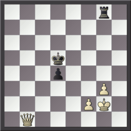

# Chess tactic — Wikipedia (text + inline FEN/ASCII diagrams)

Source: https://en.wikipedia.org/wiki/Chess_tactic
License: text CC BY-SA 4.0 (Wikipedia); position diagrams reconstructed losslessly from the article's {{Chess diagram}} wikitext into FEN+ASCII (verified in python-chess); composed images from Wikimedia Commons (CC/PD). Retrieved 2026-06-24.
Diagrams: 3 positions inlined as FEN+grid; 1 images downloaded.

---

In chess, a **tactic** is a sequence of moves that each makes one or more immediate threats – a check, a  threat, a checkmating sequence threat, or the threat of another tactic or otherwise forcing moves – that culminates in the opponent's being unable to respond to all of the threats without making some kind of concession. Most often, the immediate benefit takes the form of a material advantage or ; however, some tactics are used for defensive purposes and can salvage material that would otherwise be lost, or to induce stalemate in an otherwise lost position. 

Tactics are usually contrasted with strategy, whereby the individual moves by themselves do not make indefensible threats, and the cumulative advantage of them takes longer to capitalise. The dichotomy can be summarised as tactics concerning short-term play and strategy concerning long-term play. Examples of strategic advantages are  in, compromised pawn structure in, and sustained pressure on, the opponent's position. Often, to dichotomize strategy and tactics, sequences of moves that make strategic instead of tactical threats or use tactical threats to obtain a strategic advantage are also classified as tactics.

Tactics usually follow one of a number of repeating patterns; these include forks, skewers, batteries, discovered attacks, undermining, overloading, deflection, pins, and interference. The *Encyclopedia of Chess Middlegames* gives the following tactics categories: Annihilation of Defense, Blockade, Decoying, Deflection, Demolition of Pawns, Discovered Attack, Double Attack, Interception, Intermediate Move, Overloading, Passed Pawn, Pawns Breakthrough, Pin, Pursuit (perpetual attack), Space Clearance, Trapping a piece, and X-ray Attack. Often tactics of more than one type are conjoined in a combination. 

## Attacking and defending pieces
A piece is said to *attack* (or threaten) an opponent's piece if, on the next move, it could capture that piece. A piece is said to *defend* (or protect) a piece of the defender's color if, in case the defended piece were taken by the opponent, the defender could immediately recapture. Attacking a piece usually, but not always (see Sacrifice), forces the opponent to respond if the attacked piece is undefended, or if the attacking piece is of lower value than the one attacked.

When the piece attacked is a king, then a player has at most three options:
*capture the attacking piece;
*move the king to an adjacent square that is not under attack;
*interpose another piece in between the king and the attacking piece (if the attacker is not a knight and is not directly adjacent to the attacked king).

When the attacked piece is not a king, a player may have additional options, beyond the ones listed above:
*move the attacked piece to a square where it will not be under attack, or will be defended by another piece;
*move the attacked piece to a different attacked square, where a capture will result in a more advantageous position;
*defend the attacked piece, permitting an exchange;
*pin the attacking piece so the capture becomes illegal, unprofitable, or less damaging;
*capture a different piece of the opponent; 
*allow the attacked piece to be captured without immediate material compensation (i.e. sacrificed) for some other tactical advantage or for tempo;
*employ a *zwischenzug* (create a counter-threat).

## Gaining material
When a player is able to capture the opponent's piece(s) without losing any of their own (or losing a piece of lesser value), the player is said to have "won "; i.e., the opponent will have fewer (or less valuable) pieces remaining on the board. The goal of each basic tactic is to win material. At the professional level, often the mere threat of material loss (i.e., an anticipated tactic) induces the opponent to pursue an alternative line.  In amateur games, however, tactics often come to full fruition – unforeseen by the opponent and resulting in material gain and a corresponding, perhaps decisive, advantage. Material gain can be achieved by several different types of tactics.

## Discovered attack
A *discovered attack* is a move that allows an attack by another piece. A piece is moved away so as to allow the attack of a friendly bishop, rook or queen on an enemy piece. If the attacked piece is the king, the situation is referred to as a *discovered check*. Discovered attacks are powerful since the moved piece may be able to pose a second threat.

A special case of a discovered check is a *double check*, where both the piece being unmasked and the piece being moved (rarely a third piece instead, possible in the case of an en passant capture) attack the enemy king. A double check always forces the opponent to move the king, since it is impossible to defend against attacks from two directions in any other way.

## Fork

**Diagram 1** — FEN `1r3k2/1ppN1ppb/3np1np/8/3P1q2/8/1PP2NPP/1R1BQ1RK w - - 0 1`

```
8  . r . . . k . .
7  . p p N . p p b
6  . . . n p . n p
5  . . . . . . . .
4  . . . P . q . .
3  . . . . . . . .
2  . P P . . N P P
1  . R . B Q . R K
   a b c d e f g h
```

A *fork* is a move that uses one piece to attack two or more of the opponent's pieces simultaneously, with the aim to achieve material advantage, since the opponent can counter only one of the threats. Knights are often used for forks, with their unique moving and jumping ability, which makes them able to attack any enemy piece except for an enemy knight without being attacked in return. A common situation is a knight played to c2 or c7, threatening both the enemy rook and king. Such forks checking a king are particularly effective, because the opponent is forced by the  rules of chess to immediately remove the check to their king. The opponent cannot choose to defend the other piece, or use a *zwischenzug* (other than a cross check) to complicate the situation. Pawns can also be effective in forking. By moving a pawn forward, it can attack two pieces—one diagonally to the left, and another diagonally to the right, and because it is worth less than all other pieces, it does not matter if either or both forked pieces are defended.

The queen is also an excellent forking piece, since she can move in eight different directions. However, a queen fork is only useful if both pieces are undefended, or if one is undefended and the other is the enemy's king. The queen is the most valuable attacking piece, so it is usually not profitable for her to capture a defended piece.

Fork attacks can be either *relative* (meaning the attacked pieces comprise pawn[s], knight[s], bishop[s], rook[s], or queen[s]), or *absolute* (one of the attacked pieces is the enemy king, in check). The targets of a fork do not have to be pieces. One or more of the targets can be a mate threat (for example, forking a loose knight and setting up a battery of queen and bishop that creates a mate threat as well) or implied threat (for example, a knight move that forks a loose bishop and also threatens to fork enemy queen and rook).

## Pin

**Diagram 2** — FEN `5kb1/1p2rqpp/6n1/2B2p1B/5P2/2Q5/1PPP2PP/3KR3 w - - 0 1`

```
8  . . . . . k b .
7  . p . . r q p p
6  . . . . . . n .
5  . . B . . p . B
4  . . . . . P . .
3  . . Q . . . . .
2  . P P P . . P P
1  . . . K R . . .
   a b c d e f g h
```

A *pin* is a move that inhibits an opponent piece from moving, because doing so would expose a more valuable (or vulnerable) piece behind it. Only bishops, rooks, and queens can perform a pin, since they can move more than one square in a straight line. If the pinned piece cannot move because doing so would produce check, the pin is called *absolute*. If moving the pinned piece would expose a non-king piece, the pin is called *relative*.

## Skewer
A *skewer* is a move that attacks two pieces in a line, similar to a pin, except that the enemy piece of greater value is in front of the piece of lesser value. After the more valuable piece moves away, the lesser piece can be captured. Like pins, only queens, rooks, and bishops can perform the skewer, and skewer attacks can be either *absolute* (the more valuable piece in front is the king, in check) or *relative* (the piece in front is a non-king piece).


*Example of an absolute skewer attack*

## Pawns
The pawn is the least valuable chess piece, so pawns are often used to capture defended pieces. A single pawn typically forces a more powerful piece, such as a rook or a knight, to retreat. The ability to fork two enemy  pieces by advancing a pawn is often a threat. Alternately, a pawn move can itself reveal a discovered attack. When pawns are arranged on a diagonal, with each pawn guarded by the pawn behind it, they form a wall or '''' protecting any friendly pieces behind them. A weak pawn structure, with unprotected or isolated pawns ahead of more valuable pieces, can be a decisive weakness. A pawn that has advanced all the way to the opposite side of the board is promoted to any other piece except a king.

## Sacrifices

**Diagram 3** — FEN `1r1bqr1k/1pp1n1pp/4bp2/8/4p3/3P2N1/1PP3PP/1R1BQR1K w - - 0 1`

```
8  . r . b q r . k
7  . p p . n . p p
6  . . . . b p . .
5  . . . . . . . .
4  . . . . p . . .
3  . . . P . . N .
2  . P P . . . P P
1  . R . B Q R . K
   a b c d e f g h
```

A *sacrifice* of some material is often necessary to throw the opponent's position out of balance, potentially gaining positional advantage. The sacrificed material is sometimes later offset with a consequent material gain. Pawn sacrifices in the opening are known as gambits; they are usually not intended for material gain, but rather to achieve a more active position.

Direct attacks against the enemy king are often started by sacrifices. A common example is sacrificing a bishop on h2 or h7, checking the king, who usually must take the bishop. This allows the queen and knight to develop a fulminant attack.

## Zugzwang
*Zugzwang* (German for "compulsion to move") occurs when a player is forced to make an undesirable move. The player is put at a disadvantage because they would prefer to pass and make no move, but a move has to be made, all choices of which weaken their position. Situations involving zugzwang seldom occur before the endgame, where there are fewer choices of available moves.

## Zwischenzug
*Zwischenzug* (German for "intermediate move") is a common tactic in which a player under threat, instead of directly countering or recapturing, introduces an even more devastating threat.  The tactic often involves a new attack against the opponent's queen or king. The opponent then may be forced to address the new threat, abandoning the earlier attack.

## See also
* Anti-computer chess
* Chess strategy
* Cross-check
* Decoy
* Deflection
* Desperado
* Interference
* *Outline of chess: Chess tactics*
* Overloading
* Pawn storm
* Pawn structure
* Staircase maneuver
* Tempo
* Triangulation
* Undermining
* Windmill
* Shogi tactics

## References
## Further reading
*