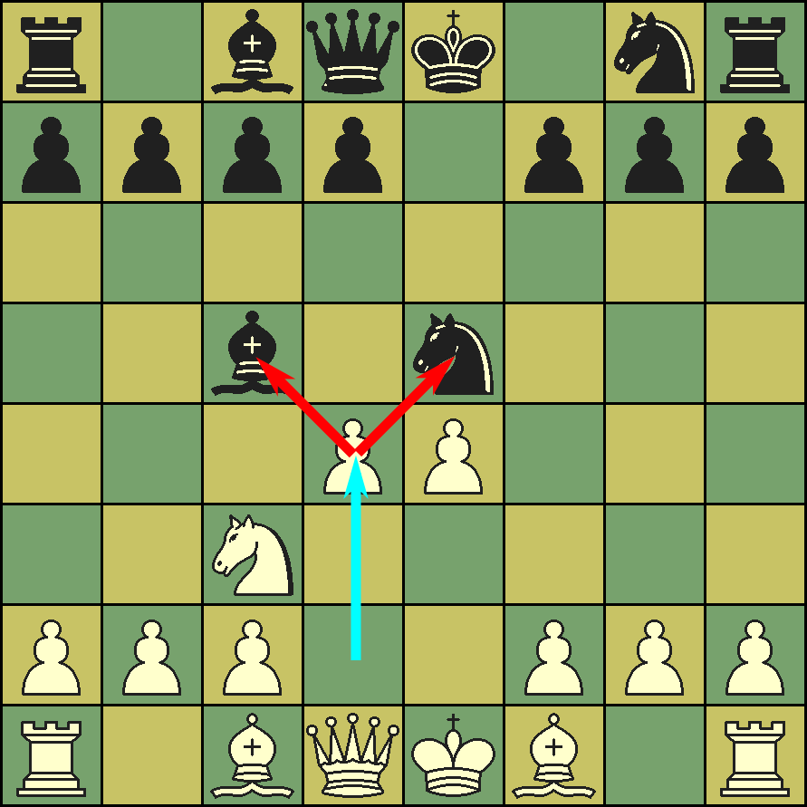

# Fork (chess) — Wikipedia (text + inline FEN/ASCII diagrams)

Source: https://en.wikipedia.org/wiki/Fork_(chess)
License: text CC BY-SA 4.0 (Wikipedia); position diagrams reconstructed losslessly from the article's {{Chess diagram}} wikitext into FEN+ASCII (verified in python-chess); composed images from Wikimedia Commons (CC/PD). Retrieved 2026-06-24.
Diagrams: 5 positions inlined as FEN+grid; 1 images downloaded.

---


**Diagram 1** — FEN `1r6/4k3/2N5/8/7p/6R1/8/3K4 w - - 0 1`

```
8  . r . . . . . .
7  . . . . k . . .
6  . . N . . . . .
5  . . . . . . . .
4  . . . . . . . p
3  . . . . . . R .
2  . . . . . . . .
1  . . . K . . . .
   a b c d e f g h
```


*Chessboard showing pawn in forking position.*

In chess, a **fork** is a tactic in which a piece  multiple enemy pieces simultaneously. The attacker usually aims to capture one of the forked pieces. The defender often cannot counter every threat. A fork is most effective when it is , such as when the king is put in check. A fork is a type of .

## Terminology<span class="anchor" id="Royal Fork"></span><span class="anchor" id="Grand Fork"></span><span class="anchor" id="Family Fork"></span><span class="anchor" id="Relative Fork"></span><span class="anchor" id="Absolute Fork"></span>
A fork is an example of a . The type of fork is named after the type of forking piece. For example, a fork by a knight is a *knight fork*. The attacked pieces are *forked*. If the king is one of the attacked pieces, the term *absolute fork* is sometimes used, while a fork not involving the enemy king is a *relative fork*.

A fork of the king and queen, the highest -gaining fork possible, is sometimes called a *royal fork*. A fork of the enemy king, queen, and one (or both) rooks is sometimes called a *grand fork*. A knight fork of the enemy king, queen, and possibly other pieces is sometimes called a *family fork* or *family check*.

## Strategy
While any piece can deliver a fork, knights are particularly effective as the forking piece because they cannot be captured by the non-knight pieces they attack, and as a  they are less valuable than rooks and queens.

Compared to forks by other pieces, a queen fork requires more specific conditions to be helpful due to the queen's higher value. A queen fork can often lead to material or positional gain, however, when the forked pieces are undefended, poorly coordinated, or when one piece is the king.

## Game examples

**Diagram 2** — FEN `1r5k/2p1q1pb/7p/3Pp3/1p3nQ1/1P4P1/1B2B2P/3R4 w - - 0 1`  (reconstructed; may be a partial/illustrative position)

```
8  . r . . . . . k
7  . . p . q . p b
6  . . . . . . . p
5  . . . P p . . .
4  . p . . . n Q .
3  . P . . . . P .
2  . B . . B . . P
1  . . . R . . . .
   a b c d e f g h
```

<br />
This example is from the first round of the FIDE World Chess Championship 2004 between Mohamed Tissir and Alexey Dreev.  After 

:**33... Nf2+ 34. Kg1 Nd3**

White resigned. In the final position the black knight forks White's queen and rook; after the queen moves away, Black will win the exchange.

**Diagram 3** — FEN `7k/6pb/5p2/2p1nN2/5q1P/2P5/6P1/3BQ1K1 w - - 0 1`

```
8  . . . . . . . k
7  . . . . . . p b
6  . . . . . p . .
5  . . p . n N . .
4  . . . . . q . P
3  . . P . . . . .
2  . . . . . . P .
1  . . . B Q . K .
   a b c d e f g h
```

<br />
This example is from the ninth round of the Clarin GP Final between Guillermo Soppe and Fernando Braga.  After 

:**40... Qh1+**

White resigned. The only move is 41.Ke2 which enables a royal fork with 41...Nc3+, winning the queen.

**Diagram 4** — FEN `1r1bqkb1/1pppp1pp/3n2n1/5p2/3B1P2/3N2N1/1PPPP1PP/1R1BQK2 w - - 0 1`

```
8  . r . b q k b .
7  . p p p p . p p
6  . . . n . . n .
5  . . . . . p . .
4  . . . B . P . .
3  . . . N . . N .
2  . P P P P . P P
1  . R . B Q K . .
   a b c d e f g h
```

**Diagram 5** — FEN `1r1bqkb1/1ppp2pp/3n4/4pp2/3B1N2/6N1/1PPPP1PP/1R1BQK2 w - - 0 1`

```
8  . r . b q k b .
7  . p p p . . p p
6  . . . n . . . .
5  . . . . p p . .
4  . . . B . N . .
3  . . . . . . N .
2  . P P P P . P P
1  . R . B Q K . .
   a b c d e f g h
```

In the Two Knights Defense (1.e4 e5 2.Nf3 Nc6 3.Bc4 Nf6) after 4.Nc3, Black can eliminate White's e4-pawn immediately with 
:**4... Nxe4** 

due to the *fork trick* 
:**5. Nxe4 d5**

regaining either the bishop or the knight. 

## References
Category:Chess tactics
Category:Chess terminology