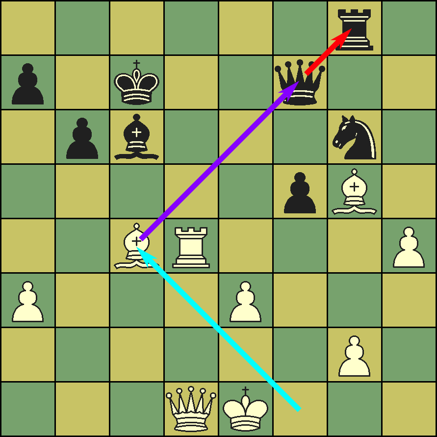

# Skewer (chess) — Wikipedia (text + inline FEN/ASCII diagrams)

Source: https://en.wikipedia.org/wiki/Skewer_(chess)
License: text CC BY-SA 4.0 (Wikipedia); position diagrams reconstructed losslessly from the article's {{Chess diagram}} wikitext into FEN+ASCII (verified in python-chess); composed images from Wikimedia Commons (CC/PD). Retrieved 2026-06-24.
Diagrams: 4 positions inlined as FEN+grid; 1 images downloaded.

---




In chess, a **skewer** is an attack upon two pieces in a line and is similar but opposite to a pin; the difference is that in a skewer, the more valuable piece is the one under direct attack and the less valuable piece is behind it. The opponent is compelled to move the more valuable piece to avoid its capture, thereby exposing the less valuable piece which can then be captured (see chess piece relative value). Only riders (i.e., bishops, rooks, and queens) can skewer; kings, knights, and pawns cannot.

## Details
Compared to the pin, a passive action with only an implied threat, the skewer is a direct attack upon the more valuable piece, making it generally a much more powerful and effective tactic. The victim of a skewer often cannot avoid losing ; the only question is which material will be lost. The skewer occurs less often than the pin in actual play. When it does occur, however, it is often decisive.

**Diagram 1** — FEN `8/4qk2/8/4b3/5KR1/6Q1/8/8 w - - 0 1`

```
8  . . . . . . . .
7  . . . . q k . .
6  . . . . . . . .
5  . . . . b . . .
4  . . . . . K R .
3  . . . . . . Q .
2  . . . . . . . .
1  . . . . . . . .
   a b c d e f g h
```

In this diagram, with White to move, the white king and queen are skewered by the black bishop. The rules of chess compel White to get out of check (if possible). After White chooses one of the handful of legal king moves available, Black will capture the white queen.

**Diagram 2** — FEN `8/2r3k1/5pp1/4q3/6P1/5PB1/5QK1/8 w - - 0 1`

```
8  . . . . . . . .
7  . . r . . . k .
6  . . . . . p p .
5  . . . . q . . .
4  . . . . . . P .
3  . . . . . P B .
2  . . . . . Q K .
1  . . . . . . . .
   a b c d e f g h
```

In this diagram, with Black to move, the black queen and rook are skewered by White's bishop. If Black moves the queen to avoid capture, White can take the rook. Black is likely to move the queen, which is more valuable than the rook, but the choice is still available (unlike the king being skewered as above).

## Examples from games

**Diagram 3** — FEN `3Q4/2p4q/1p4k1/5B1p/1P3b2/8/6PP/7K w - - 0 1`

```
8  . . . Q . . . .
7  . . p . . . . q
6  . p . . . . k .
5  . . . . . B . p
4  . P . . . b . .
3  . . . . . . . .
2  . . . . . . P P
1  . . . . . . . K
   a b c d e f g h
```

In the game Nigel Short–Rafael Vaganian, Barcelona 1989, White sacrifices a bishop to win a queen by a skewer. White has just played 51.Be5+ skewering Black's king and queen (). If Black responds 51...Kxe5 to avoid the immediate loss of the queen, 52.Qc3+ wins the queen by another skewer, when White will be favored to win. Black resigned in this position.

## Conversion

**Diagram 4** — FEN `7k/6pp/8/3p4/3P1b2/3PR3/3BP2p/7K w - - 0 1`

```
8  . . . . . . . k
7  . . . . . . p p
6  . . . . . . . .
5  . . . p . . . .
4  . . . P . b . .
3  . . . P R . . .
2  . . . B P . . p
1  . . . . . . . K
   a b c d e f g h
```

Skewers can be escaped by gaining a tempo with a credible threat. For example, if either defending piece leaves the skewer to give check, the other can be rescued on the next move. The skewer can also be reversed into a discovered attack: if the less valuable piece can attack the skewering piece, making a threat with the more valuable piece allows the defender to capture the attacker first (if the threat does not itself drive off the attacker).

If there is empty space between the skewering and the skewered pieces, it may be possible to convert the skewer into a pin by moving a lower-valued piece to intervene.

## See also
*Chess tactics
*Fork
*Pin
*X-ray

## Notes
## References
*

## External links
* [http://www.chesstr.com/problems?ta=3 Chess Tactics Repository - Skewers] - Collection of chess problems involving skewers
* [http://www.chesshistory.com/winter/extra/skewer.html "The Chess Skewer"] *Chess Notes* feature article by Edward Winter

Category:Chess tactics
Category:Chess terminology
nl:Röntgenaanval